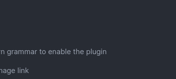

# Finding the lectern crash
A few weeks ago, a crash involving shift clicking an item into the lectern block, while the handled screen of the lectern was opened, was found. This is how it was discovered
## Background
Minecraft has "handled screens", which are essentially just GUIs bound to a block, that can modify the block's state. This is used for inventories in chests, for example. Or interacting with furnaces.
### The bug
The lectern conveniently also has that screen bound to it, but in a slightly different way

## Looking into it

test
